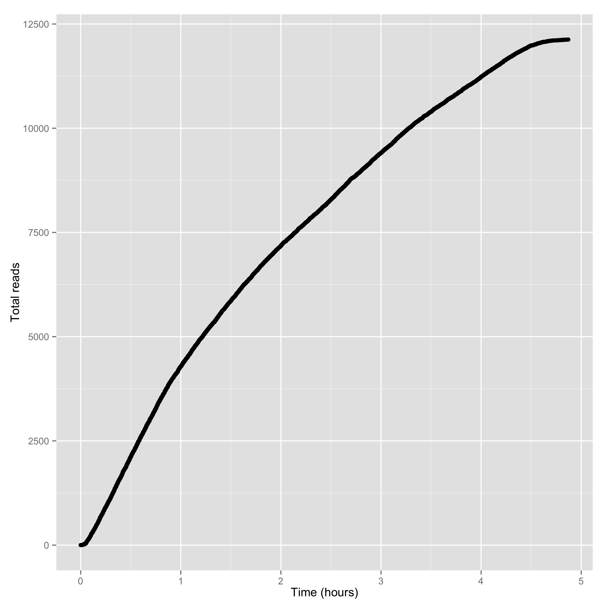
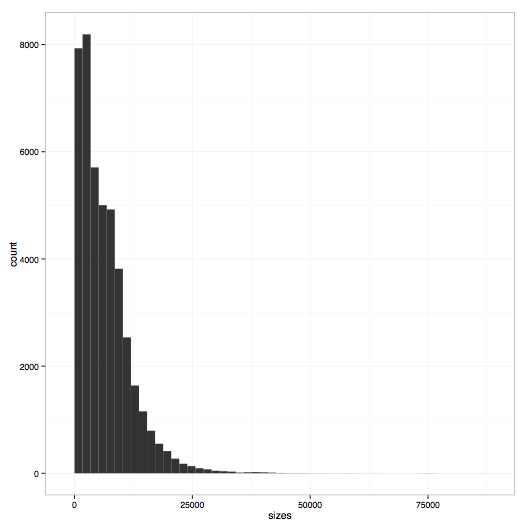
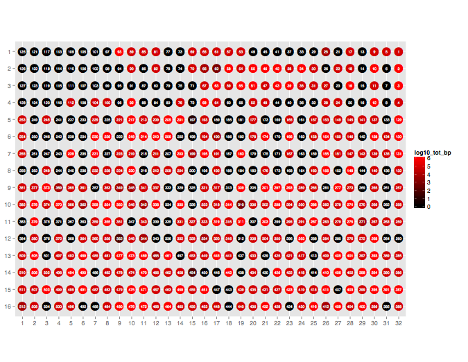

###############
Usage examples
###############

===================
poretools ``fastq``
===================
Extract sequences in FASTQ format from a set of FAST5 files.

.. code-block:: bash

    poretools fastq fast5/*.fast5

Or, if there are too many files for your OS to do the wildcard expansion, just provide a directory.
``poreutils`` will automatically find all of the FAST5 files in the directory.

.. code-block:: bash

    poretools fastq fast5/

Extract sequences in FASTQ format from a set of FAST5 files.
    
.. code-block:: bash

    poretools fastq fast5/
    poretools fastq --min-length 5000 fast5/
    poretools fastq --type all fast5/
    poretools fastq --type fwd fast5/
    poretools fastq --type rev fast5/
    poretools fastq --type 2D fast5/
    poretools fastq --type fwd,rev fast5/

Only extract sequence with more complement events than template. These are the so-called "high quality 2D reads" and are the most accurate sequences from a 
given run.

.. code-block:: bash

    poretools fastq --type 2D --high-quality fast5/

===================
poretools ``fasta``
===================
Extract sequences in FASTA format from a set of FAST5 files.

.. code-block:: bash

    poretools fasta fast5/
    poretools fasta --min-length 5000 fast5/
    poretools fasta --type all fast5/
    poretools fasta --type fwd fast5/
    poretools fasta --type rev fast5/
    poretools fasta --type 2D fast5/
    poretools fasta --type fwd,rev fast5/

=====================
poretools ``combine``
=====================
Create a tarball from a set of FAST5 (HDF5) files.

.. code-block:: bash

    # plain tar (recommended for speed)
    poretools combine -o foo.fast5.tar fast5/*.fast5

    # gzip
    poretools combine -o foo.fast5.tar.gz fast5/*.fast5

    # bzip2
    poretools combine -o foo.fast5.tar.bz2 fast5/*.fast5

========================
poretools ``yield_plot``
========================
Create a collector's curve reflecting the sequencing yield over time for a set of reads. There are two types of plots. The first is the yield of reads over time:

.. code-block:: bash

    poretools yield_plot --plot-type reads fast5/

The result should look something like:\

    
The second is the yield of base pairs over time:

.. code-block:: bash

    poretools yield_plot --plot-type basepairs fast5/

The result should look something like:
    
.. image:: _images/yield.bp.png
    :width: 400pt

Of course, you can save to PDF or PNG with `--saveas`:

.. code-block:: bash

    poretools yield_plot \
              --plot-type basepairs \
              --saveas foo.pdf\
              fast5/

    poretools yield_plot \
              --plot-type basepairs \
              --saveas foo.png\
              fast5/

If you don't like the default aesthetics, try `--theme-bw`:

.. code-block:: bash

    poretools yield_plot --theme-bw fast5/

======================
poretools ``squiggle``
======================
Make a "squiggle" plot of the signal over time for a given read or set of reads

.. code-block:: bash

    poretools squiggle fast5/foo.fast5

The result should look something like:

.. image:: _images/foo.fast5.png
    :width: 400pt

If you don't like the default aesthetics, try `--theme-bw`:

.. code-block:: bash

    poretools squiggle --theme-bw fast5/

Other options:

.. code-block:: bash

    # save as PNG
    poretools squiggle --saveas png fast5/foo.fast5

    # save as PDF
    poretools squiggle --saveas pdf fast5/foo.fast5

    # make a PNG for each FAST5 file in a directory
    poretools squiggle --saveas png fast5/

====================
poretools ``winner``
====================
Report the longest read among a set of FAST5 files.

.. code-block:: bash

    poretools winner fast5/
    poretools winner --type all fast5/
    poretools winner --type fwd fast5/
    poretools winner --type rev fast5/
    poretools winner --type 2D fast5/
    poretools winner --type fwd,rev fast5/

===================
poretools ``stats``
===================
Collect read size statistics from a set of FAST5 files.

.. code-block:: bash

    poretools stats fast5/
    total reads 2286.000000
    total base pairs    8983574.000000
    mean    3929.822397
    median  4011.500000
    min 13.000000
    max 6864.000000

===================
poretools ``hist``
===================
Plot a histogram of read sizes from a set of FAST5 files.

.. code-block:: bash

    poretools hist fast5/
    poretools hist --min-length 1000 --max-length 10000 fast5/

    poretools hist --num-bins 20 --max-length 10000 fast5/

If you don't like the default aesthetics, try `--theme-bw`:

.. code-block:: bash

    poretools hist --theme-bw fast5/

The result should look something like:

=====================
poretools ``nucdist``
=====================
Look at the nucleotide composition of a set of FAST5 files.

.. code-block:: bash
 
    poretools nucdist fast5/
    A   78287   335291  0.233489714904
    C   75270   335291  0.224491561062
    T   92575   335291  0.276103444471
    G   84754   335291  0.252777438106
    N   4405    335291  0.0131378414571

======================
poretools ``qualdist``
======================
Look at the quality score composition of a set of FAST5 files.

.. code-block:: bash

    poretools qualdist fast5/
    !   0   83403   335291  0.248748102395
    "   1   46151   335291  0.137644613187
    #   2   47463   335291  0.141557632027
    $   3   34471   335291  0.102809201559
    %   4   24879   335291  0.0742012162569
    &   5   20454   335291  0.0610037251224
    '   6   16783   335291  0.0500550268274
    (   7   13699   335291  0.0408570465655
    )   8   11356   335291  0.0338690868529
    *   9   9077    335291  0.0270720061081
    +   10  6492    335291  0.0193622852984
    ,   11  4891    335291  0.014587328619
    -   12  3643    335291  0.0108651887465
    .   13  2585    335291  0.00770972080968
    /   14  1969    335291  0.0058725107444
    0   15  1475    335291  0.00439916371152
    1   16  1146    335291  0.00341792651756
    2   17  902 335291  0.00269020045274
    3   18  790 335291  0.00235616225905
    4   19  619 335291  0.0018461575169
    5   20  532 335291  0.00158668142002
    6   21  440 335291  0.00131229290378
    7   22  397 335291  0.00118404609727
    8   23  379 335291  0.00113036138757
    9   24  313 335291  0.000933517452004
    :   25  327 335291  0.000975272226215
    ;   26  138 335291  0.000411582774366
    <   27  121 335291  0.000360880548538
    =   28  96  335291  0.000286318451733
    >   29  76  335291  0.000226668774289
    ?   30  69  335291  0.000205791387183
    @   31  61  335291  0.000181931516205
    A   32  48  335291  0.000143159225866
    B   33  23  335291  6.8597129061e-05
    C   34  14  335291  4.17547742111e-05
    D   35  6   335291  1.78949032333e-05
    F   37  3   335291  8.94745161666e-06

=====================
poretools ``tabular``
=====================
Dump the length, name, seq, and qual of the sequence in one or a set of FAST5 files.

.. code-block:: bash

    poretools tabular foo.fast5 
    length  name    sequence    quals
    10    @channel_100_read_14_complement   GTCCCCAACAACAC    $%%'"$"%!)

====================
poretools ``events``
====================
Extract the raw nanopore events from each FAST5 file.

.. code-block:: bash

    poretools events burn-in-run-2 | head -5
    file    strand  mean    start   stdv    length  model_state model_level move    p_model_state   mp_model_state  p_mp_model_state    p_A p_C p_G p_T raw_index
    burn-in-run-2/ch100_file15_strand.fast5  template    56.4648513559   6595.744    1.62598948551   0.026   TGCAT   56.064011186    0   0.076552246287  TGCAT   0.076552246287  0.0980897489641 0.46074353628   0.320651683129  1.90528272165e-05   0
    burn-in-run-2/ch100_file15_strand.fast5  template    53.2614042745   6595.77 1.12361695715   0.0262  GCATA   54.0674114279   1   0.162623875514  GCGAC   0.183337198021  0.437486003645  0.214306730736  0.335497877123  0.0103035924549 1
    burn-in-run-2/ch100_file15_strand.fast5  template    51.0001271042   6595.7962   1.07380437991   0.1422  CATAG   52.1964606541   1   0.186606921109  CATAG   0.186606921109  0.424764995152  0.205766683286  0.0905615869544 0.277004168889  2
    burn-in-run-2/ch100_file15_strand.fast5  template    49.6976788934   6595.9384   1.03634357984   0.0364  ATAGC   51.1117557194   1   0.181952967376  ATAGC   0.181952967376  0.296106771209  0.408638426765  0.0754069980523 0.217721405945  3
    burn-in-run-2/ch100_file15_strand.fast5  template    51.7633085659   6595.9748   1.04743182078   0.0456  TAGCA   52.6955397413   1   0.192582310652  TAGCA   0.192582310652  0.250481934498  0.311756355221  0.311208716953  0.12343821687   4

Extract the pre basecalled events from each FAST5 file. 

.. code-block:: bash
    poretools events --pre-basecalled burn-in-run-2 | head -5
    file    strand  mean    start   stdv    length  model_state     model_level     move    p_model_state   mp_model_state  p_mp_model_state        p_A     p_C     p_G     p_T     raw_index
    burn-in-run-2/ch100_file15_strand.fast5     pre_basecalled  51.4652695313   5352344 0.655003995591      35
    burn-in-run-2/ch100_file15_strand.fast5     pre_basecalled  60.1776123047   5352379 1.05143911309       18
    burn-in-run-2/ch100_file15_strand.fast5     pre_basecalled  48.9152374359   5352397 0.864834628834      67
    burn-in-run-2/ch100_file15_strand.fast5     pre_basecalled  55.4002178596   5352464 1.75915620083       17    

===================
poretools ``times``
===================
Extract the start time of each detected molecule into tabular format.

=======================
poretools ``occupancy``
=======================
Plot the throughput performance of each pore on the flowcell during a given sequencing run.

.. code-block:: bash

    poretools occupancy fast5/

The result should look something like:

