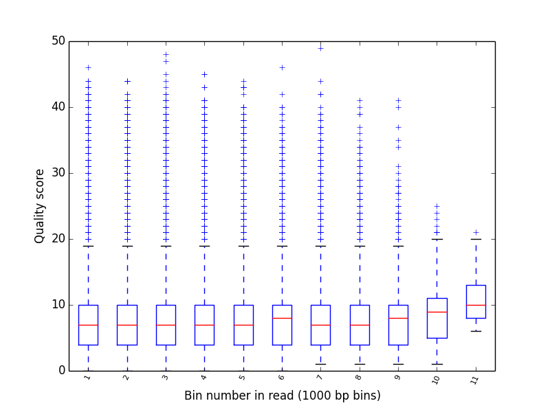

###############
Usage examples
###############

.. note::

   In the following examples, ``test_data`` can be replaced with the directory containing the FAST5 files
   from your own runs. If you are new to ONT sequencing, the ``test_data`` directory is shipped with ``poretools``
   for experimentation.

===================
poretools ``fastq``
===================
Extract sequences in FASTQ format from a set of FAST5 files.

.. code-block:: bash

    poretools fastq test_data/*.fast5

Or, if there are too many files for your OS to do the wildcard expansion, just provide a directory.
``poreutils`` will automatically find all of the FAST5 files in the directory.

.. code-block:: bash

    poretools fastq test_data/

Extract sequences in FASTQ format from a set of FAST5 files.
    
.. code-block:: bash

    poretools fastq test_data/
    poretools fastq --min-length 5000 test_data/
    poretools fastq --max-length 5000 test_data/
    poretools fastq --type all test_data/
    poretools fastq --type fwd test_data/
    poretools fastq --type rev test_data/
    poretools fastq --type 2D test_data/
    poretools fastq --type fwd,rev test_data/

A type of "best" will extract the 2D read, if it exists. If not, it will extract either the template or complement read, whichever is available and has a better average Phred score.

.. code-block:: bash

    poretools fastq --type best test_data/

Only extract sequence with more complement events than template. These are the so-called "high quality 2D reads" and are the most accurate sequences from a 
given run.

.. code-block:: bash

    poretools fastq --type 2D --high-quality test_data/

The data in fastq format are returned in standard output.

===================
poretools ``fasta``
===================
Extract sequences in FASTA format from a set of FAST5 files.

.. code-block:: bash

    poretools fasta test_data/
    poretools fasta --min-length 5000 test_data/
    poretools fasta --max-length 5000 test_data/
    poretools fasta --type all test_data/
    poretools fasta --type fwd test_data/
    poretools fasta --type rev test_data/
    poretools fasta --type 2D test_data/
    poretools fasta --type fwd,rev test_data/
    poretools fasta --type best test_data/

The data in fasta format are returned in standard output.

=====================
poretools ``combine``
=====================
Create a tarball from a set of FAST5 (HDF5) files.

.. code-block:: bash

    # plain tar (recommended for speed)
    poretools combine -o foo.fast5.tar test_data/*.fast5

    # gzip
    poretools combine -o foo.fast5.tar.gz test_data/*.fast5

    # bzip2
    poretools combine -o foo.fast5.tar.bz2 test_data/*.fast5

========================
poretools ``yield_plot``
========================
Create a collector's curve reflecting the sequencing yield over time for a set of reads. There are two types of plots. The first is the yield of reads over time:

.. code-block:: bash

    poretools yield_plot --plot-type reads test_data/2016*fast5

The result should look something like:\

.. image:: _images/yield.reads.png
    :width: 400pt
    
The second is the yield of base pairs over time:

.. code-block:: bash

    poretools yield_plot --plot-type basepairs test_data/2016*fast5

The result should look something like:
    
.. image:: _images/yield.bp.png
    :width: 400pt

Of course, you can save to PDF or PNG with `--saveas`:

.. code-block:: bash

    poretools yield_plot \
              --plot-type basepairs \
              --saveas foo.pdf\
              test_data/

    poretools yield_plot \
              --plot-type basepairs \
              --saveas foo.png\
              test_data/

If you don't like the default aesthetics, try `--theme-bw`:

.. code-block:: bash

    poretools yield_plot --theme-bw test_data/

======================
poretools ``squiggle``
======================
Make a "squiggle" plot of the signal over time for a given read or set of reads

.. code-block:: bash

    poretools squiggle test_data/foo.fast5

The result should look something like:

.. image:: _images/foo.fast5.png
    :width: 400pt

If you don't like the default aesthetics, try `--theme-bw`:

.. code-block:: bash

    poretools squiggle --theme-bw test_data/

Other options:

.. code-block:: bash

    # save as PNG
    poretools squiggle --saveas png test_data/foo.fast5

    # save as PDF
    poretools squiggle --saveas pdf test_data/foo.fast5

    # make a PNG for each FAST5 file in a directory
    poretools squiggle --saveas png test_data/

====================
poretools ``winner``
====================
Report the longest read among a set of FAST5 files.

.. code-block:: bash

    poretools winner test_data/
    poretools winner --type all test_data/
    poretools winner --type fwd test_data/
    poretools winner --type rev test_data/
    poretools winner --type 2D test_data/
    poretools winner --type fwd,rev test_data/
    poretools winner --type best test_data/

===================
poretools ``stats``
===================
Collect read size statistics from a set of FAST5 files.

.. code-block:: bash

    poretools stats test_data/
    total reads 2286.000000
    total base pairs    8983574.000000
    mean    3929.822397
    median  4011.500000
    min 13.000000
    max 6864.000000

===================
poretools ``hist``
===================
Plot a histogram of read sizes from a set of FAST5 files.

.. code-block:: bash

    poretools hist test_data/
    poretools hist --min-length 1000 --max-length 10000 test_data/

    poretools hist --num-bins 20 --max-length 10000 test_data/

If you don't like the default aesthetics, try `--theme-bw`:

.. code-block:: bash

    poretools hist --theme-bw test_data/

The result should look something like:

.. image:: _images/hist.png
    :width: 400pt    

=====================
poretools ``nucdist``
=====================
Look at the nucleotide composition of a set of FAST5 files.

.. code-block:: bash
 
    poretools nucdist test_data/
    A   78287   335291  0.233489714904
    C   75270   335291  0.224491561062
    T   92575   335291  0.276103444471
    G   84754   335291  0.252777438106
    N   4405    335291  0.0131378414571

======================
poretools ``qualdist``
======================
Look at the quality score composition of a set of FAST5 files.

.. code-block:: bash

    poretools qualdist test_data/
    !   0   83403   335291  0.248748102395
    "   1   46151   335291  0.137644613187
    #   2   47463   335291  0.141557632027
    $   3   34471   335291  0.102809201559
    %   4   24879   335291  0.0742012162569
    &   5   20454   335291  0.0610037251224
    '   6   16783   335291  0.0500550268274
    (   7   13699   335291  0.0408570465655
    )   8   11356   335291  0.0338690868529
    *   9   9077    335291  0.0270720061081
    +   10  6492    335291  0.0193622852984
    ,   11  4891    335291  0.014587328619
    -   12  3643    335291  0.0108651887465
    .   13  2585    335291  0.00770972080968
    /   14  1969    335291  0.0058725107444
    0   15  1475    335291  0.00439916371152
    1   16  1146    335291  0.00341792651756
    2   17  902 335291  0.00269020045274
    3   18  790 335291  0.00235616225905
    4   19  619 335291  0.0018461575169
    5   20  532 335291  0.00158668142002
    6   21  440 335291  0.00131229290378
    7   22  397 335291  0.00118404609727
    8   23  379 335291  0.00113036138757
    9   24  313 335291  0.000933517452004
    :   25  327 335291  0.000975272226215
    ;   26  138 335291  0.000411582774366
    <   27  121 335291  0.000360880548538
    =   28  96  335291  0.000286318451733
    >   29  76  335291  0.000226668774289
    ?   30  69  335291  0.000205791387183
    @   31  61  335291  0.000181931516205
    A   32  48  335291  0.000143159225866
    B   33  23  335291  6.8597129061e-05
    C   34  14  335291  4.17547742111e-05
    D   35  6   335291  1.78949032333e-05
    F   37  3   335291  8.94745161666e-06

======================
poretools ``qualpos``
======================
Produce a box-whisker plot of qualoty score distribution over positions in reads.

.. code-block:: bash

    poretools qualpos test_data/

The result should look something like:

=====================
poretools ``tabular``
=====================
Dump the length, name, seq, and qual of the sequence in one or a set of FAST5 files.

.. code-block:: bash

    poretools tabular foo.fast5 
    length  name    sequence    quals
    10    @channel_100_read_14_complement   GTCCCCAACAACAC    $%%'"$"%!)

====================
poretools ``events``
====================
Extract the raw nanopore events from each FAST5 file.

.. code-block:: bash

    poretools events test_data/ | head -5
    file    strand  mean    start   stdv    length  model_state model_level move    p_model_state   mp_model_state  p_mp_model_state    p_A p_C p_G p_T raw_index
    test_data/2016_3_4_3507_1_ch120_read240_strand.fast5    template    58.3245290305   1559.89409031   1.34165996292   0.0146082337317 CGACTT  58.1304809188   0   0.0226559   CATCTT  0.0229866   0.284469    0.130683    0.137386    0.447461
    test_data/2016_3_4_3507_1_ch120_read240_strand.fast5    template    50.1420877511   1559.90869854   0.921372775302  0.0348605577689 GACTTT  49.3934875964   1   0.0849836   GACTTT  0.0849836   0.257314    0.350541    0.101351    0.290794
    test_data/2016_3_4_3507_1_ch120_read240_strand.fast5    template    47.5841029424   1559.9435591    0.771398562801  0.00763612217795    ACTTTG  48.2080162623   1   0.108899    TCTTTG  0.13079 0.000477931 0.00853333  0.306356    0.684632
    test_data/2016_3_4_3507_1_ch120_read240_strand.fast5    template    51.5879264562   1559.95119522   0.684238307171  0.0112881806109 CTTTGA  52.7784154546   1   0.110625    CTTTGG  0.121103    4.69995e-06 0.00382846  0.0169048   0.979262

Extract the pre-basecalled events from each FAST5 file. 

.. code-block:: bash

    poretools events --pre-basecalled test_data/ | head -5
    file    strand  mean    start   stdv    length  model_state     model_level     move    p_model_state   mp_model_state  p_mp_model_state        p_A     p_C     p_G     p_T     raw_index
    burn-in-run-2/ch100_file15_strand.fast5     pre_basecalled  51.4652695313   5352344 0.655003995591      35
    burn-in-run-2/ch100_file15_strand.fast5     pre_basecalled  60.1776123047   5352379 1.05143911309       18
    burn-in-run-2/ch100_file15_strand.fast5     pre_basecalled  48.9152374359   5352397 0.864834628834      67
    burn-in-run-2/ch100_file15_strand.fast5     pre_basecalled  55.4002178596   5352464 1.75915620083       17    

===================
poretools ``times``
===================

.. code-block:: bash

    poretools times test_data/ | head -5
    channel filename    read_length exp_starttime   unix_timestamp  duration    unix_timestamp_end  iso_timestamp   day hour    minute
    120 test_data/2016_3_4_3507_1_ch120_read240_strand.fast5    5826    1457127309  1457128868  47  1457128915  2016-03-04T15:01:08-0700    04  15  01
    120 test_data/2016_3_4_3507_1_ch120_read353_strand.fast5    3399    1457127309  1457129863  28  1457129891  2016-03-04T15:17:43-0700    04  15  17
    120 test_data/2016_3_4_3507_1_ch120_read415_strand.fast5    2640    1457127309  1457130808  24  1457130832  2016-03-04T15:33:28-0700    04  15  33
    120 test_data/2016_3_4_3507_1_ch120_read418_strand.fast5    3487    1457127309  1457130851  31  1457130882  2016-03-04T15:34:11-0700    04  15  34

=======================
poretools ``occupancy``
=======================
Plot the throughput performance of each pore on the flowcell during a given sequencing run.

.. code-block:: bash

    poretools occupancy test_data/

The result should look something like:

.. image:: _images/occupancy.png
    :width: 400pt  

===================
poretools ``index``
===================
Tabulate all file location info and metadata such as ASIC ID and temperature from a set of FAST5 files

.. code-block:: bash

    poretools index test_data | head -5 | column -t
    source_filename                                       template_fwd_length  complement_rev_length  2d_length  asic_id     asic_temp  heatsink_temp  channel  exp_start_time  exp_start_time_string_date  exp_start_time_string_time  start_time  start_time_string_date  start_time_string_time  duration  fast5_version
    test_data/2016_3_4_3507_1_ch120_read240_strand.fast5  5826                 5011                   5079       3571011476  30.37      36.99          120      1457127309      2016-Mar-04                 (Fri)                       14:35:09    1457128868              2016-Mar-04             (Fri)     15:01:08       47  metrichor1.16
    test_data/2016_3_4_3507_1_ch120_read353_strand.fast5  3399                 2962                   2940       3571011476  30.37      36.99          120      1457127309      2016-Mar-04                 (Fri)                       14:35:09    1457129863              2016-Mar-04             (Fri)     15:17:43       28  metrichor1.16
    test_data/2016_3_4_3507_1_ch120_read415_strand.fast5  2640                 2244                   2428       3571011476  30.37      36.99          120      1457127309      2016-Mar-04                 (Fri)                       14:35:09    1457130808              2016-Mar-04             (Fri)     15:33:28       24  metrichor1.16
    test_data/2016_3_4_3507_1_ch120_read418_strand.fast5  3487                 2950                   3384       3571011476  30.37      36.99          120      1457127309      2016-Mar-04                 (Fri)                       14:35:09    1457130851              2016-Mar-04             (Fri)     15:34:11       31  metrichor1.16

======================
poretools ``metadata``
=======================
Extract the metadata from the fast5 file

.. code-block:: bash

    poretools metadata  013731_11rx_v2_3135_1_ch20_file19_strand.fast5

    asic_id asic_temp   heatsink_temp
    31037   28.11   37.88

    poretools metadata --read  013731_11rx_v2_3135_1_ch20_file19_strand.fast5
    filename    scaling_used    abasic_peak_height  hairpin_polyt_level median_before   start_time  read_id read_number hairpin_peak_height abasic_found    abasic_event_index  duration    start_mux   hairpin_found   hairpin_event_index
    013731_11rx_v2_3135_1_ch20_file19_strand.fast5    1   124.31769966    0.413218809334  226.393825112   4648221 3b4e45bf-6d42-45bc-9314-1d8a630971c2    19  125.783167256   1   2   195322  4   1   1478

